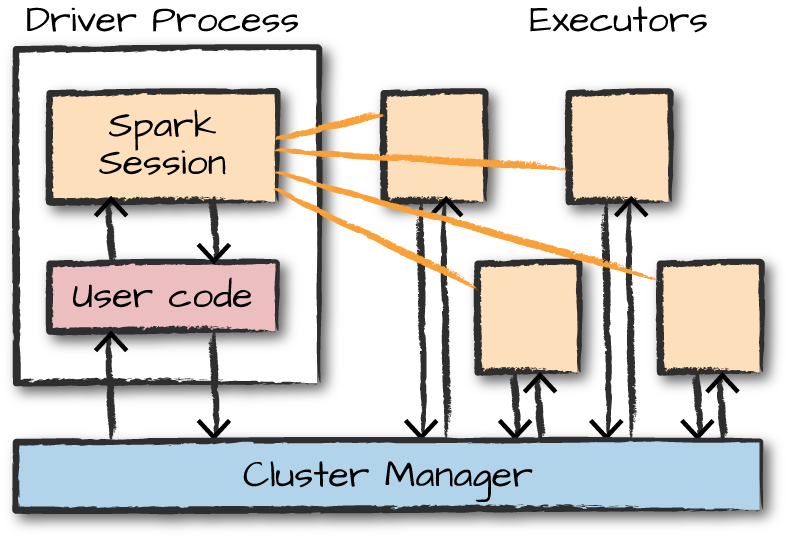
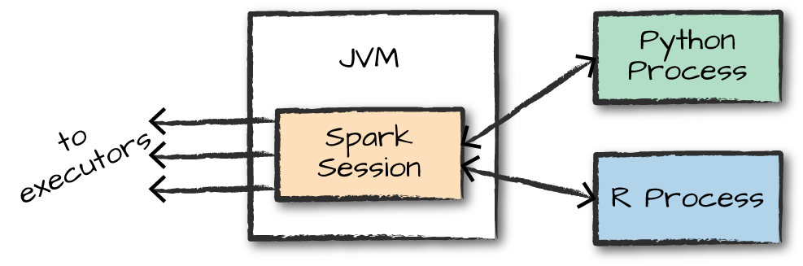
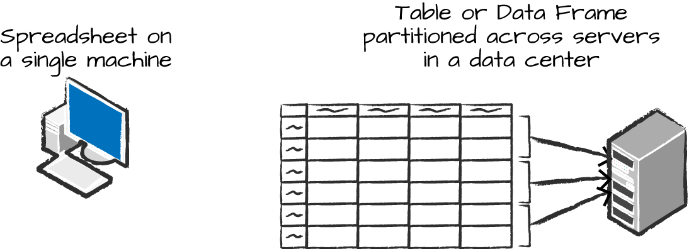
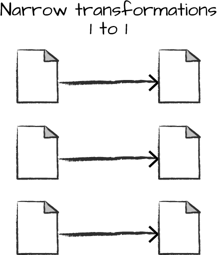
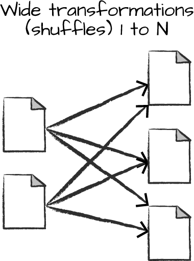
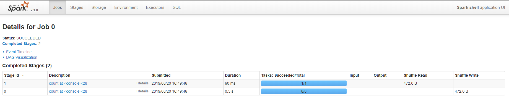
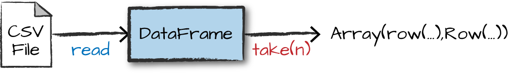
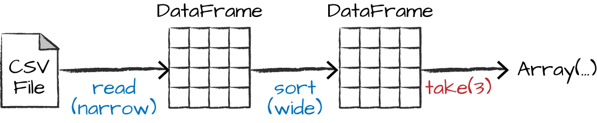
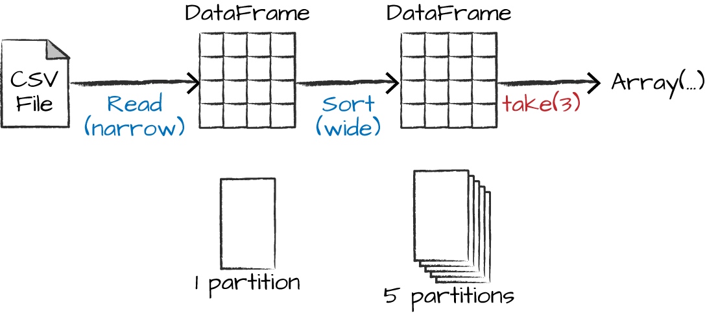

# Spark 程序

[TOC]

Spark程序由driver进程和一系列executor进程组成。在集群的某个节点上，driver进程执行main()函数，它主要负责三件事情：维护Spark应用程序的相关信息；响应用户程序或输入；分析，分发和在executors中调度工作。

executors是负责实际执行driver分发的工作。这表示executor只负责两件事：执行driver分配给它的代码，以及将executor上计算的状态报告给drvier节点。



上图显示了集群管理器如何控制物理机和分配资源给Spark应用程序。有三种集群管理器，Spark独立的集群管理器，YARN和Mesos。这意味着一个Spark集群可以同时运行多个Spark应用程序。


	Spark除了集群模式，还有一种本地模式。driver和executors都是简单的进程，这意味着他们可以运行在同一个机器上或者不同的机器上。在本地模式中，driver和executors以线程的方式运行在个人的计算机上而不是集群中。

关于Spark应用程序由两点需要理解：
* Spark使用一个集群管理器追踪可用资源
* driver进程负责跨executors得执行driver程序中的命令以完整一个给定任务

大部分情况下，executors始终运行Spark代码。然而，driver则可以从Spark多个语言的API中产生。


## Spark 的语言API
Spark的语言API使得使用多种编程语言运行Spark代码成为可能。大部分情况下，Spark在所有的语言中提供了一些核心的概念；这些概念然后被翻译成运行在机器集群的Spark代码。如果你只是使用结构化API，可以期望所有的语言有相同的性能特征。

Scala
	Spark主要用Scala实现，Scala是它的默认语言。这本书将包含所有相关的Scala代码示例。

Java
	尽管Spark使用Scala实现，Spark的作者一直非常小心翼翼地保证可以使用Java语言写Spark代码。

Python
	Python几乎支持所有Scala支持的构造。无论本书有多少Scala代码例子，本书都会包含相应的Python代码例子。

SQL
	Spark支持ANSI SQL2003标准的一个子集。这对于分析人员和非开发者来说将变得更容易去利用Spark的大数据优势。本书将包含先关的SQL代码例子。

R
	Spark有两个通用R库：一个是Spark core（SparkR）的一部分，另一个作为R社区驱动的Package（sparklyr）。我们将在第32章包含这些集成。



每个语言的API保留了我们之前描述的相同核心概念。对于用户来说，SparkSession对象是运行Spark代码的入口点。当在Python或者R中使用Spark时，不需要显式地写JVM指令；相应的，只需要写Python和R代码，Spark可以将它们翻译成executor JVM可以运行的代码。


## Spark的API

尽管可以使用多种语言驱动Spark，值得一提的是这些语言中的内容。SPark有两套基本的API：低级别的非结构化API和高级的结构化API。我们在本书中都会讨论到，但是这些介绍章节，我们的精力将主要放在高级API上。


## 启动Spark

目前为止，我们介绍了Spark应用程序的基本概念。这些都是概念性的。当我们实际去写Spark应用程序时，我们需要一种方式去发送用户命令和数据给它。我们首先通过创建一个SparkSession来实现。

	我们通过./bin/spark-shell来启动Spark的本地模式，访问Scala命令行来启动一个交互式的会话。也可以通过./bin/pyspark启动Python命令行。这样我们启动了一个交互式的Spark应用程序。同样的，有一个向Spark提交应用程序的程序叫spark-summit，它可以向Spark提交一个预编译的程序。稍后我们将介绍它。


以交互式模式启动Spark时，会隐式地创建一个SparkSession来管理Spark应用程序。当通过独立的应用启动时，必须在代码中自己创建SparkSession对象。


## The SparkSession

正如本章开头讨论的，可以通过叫SparkSession的driver进程控制Spark应用程序。SparkSession实例是Spark执行用户定义操作的方式。SparkSession和Spark应用存在着一对一的关系。在Scala和Python中，这个变量在启动命令行时是可用的。我们看看在Scala和Python中的SparkSession：


```Scala
scala> spark
res0: org.apache.spark.sql.SparkSession = org.apache.spark.sql.SparkSession@5598dff2
```


```Python
Using Python version 2.7.5 (default, Aug  4 2017 00:39:18)
SparkSession available as 'spark'.
>>> spark
<pyspark.sql.session.SparkSession object at 0x2ba5f50>
```


我们执行一个简单的创建数字范围的任务，这个数字范围就像数字表格中命名列一样：

```Scala
// in Scala
scala> val myRange = spark.range(1000).toDF("number")
myRange: org.apache.spark.sql.DataFrame = [number: bigint]
```

```Python
# in Python
myRange = spark.range(1000).toDF("number")
```

这样我们就执行了第一个Spark代码！我们创建了一个列有1000行，值从0到999的*DataFrame* 。这个数字范围表示一个分布式集合。当我们在集群上运行时，这个数字范围的每一部分存在不同的executor上。这就是一个Spark DataFrame。


## DataFrame

DataFrame是最常见的结构化API，只是表示包含行和列的数据表。定义列和列中的类型的列表称为模式（Schema）。可以把DataFrame看做一个命名列了的数字表格。下图说了基本的区别：一个电子表格是在一台计算机上的某个位置，而Spark DataFrame可以横跨数千台计算机。把数据放在多台机器上的原因是非常直观的：不是数据太大到一个机器放不下就是它可能会花费一台机器太长的计算时间。




DataFrame概念不是Spark独有的。R和Python都有类似的概念。然而，Python/R DataFrame只在一台机器上而不是多台。DataFrame上可进行的操作空间将受限于特定服务器上的资源。而Spark为Python和R都提供了语言接口，将Pandas（Python）DataFrames或R DataFrames转换为Spark DataFrames将变得相当简单。


​		Spark有多个核心抽象：DataSet，DataFrame，SQL Table和RRD。这些不同的抽象都表示数据的分布式集合。最简单和高效的是DataFrame，对所有编程语言可用。


### 分区

为了使得每个executor可以并行的工作，Spark将数据分解成分区。一个分区是集群上一台物理机上的行的集合。DataFrame的分区表示在执行时数据在机器集群中的物理分布方式。如果只有一个分区，Spark将只能有一个并行度，尽管有上千个executors。如果有多个分区，但只有一个executor，Spark也只能有一个并行度。


对于DataFrame一个重要的事情是大部分情况下不需要手动的分区。我们只需要指定物理分区上的高级数据转换，Spark会决定如何分区。低级别的API也存在（通过RDD接口），我们在第三部分介绍。


## 转换


Spark中，核心的数据结构是不可变的，这意味着一旦创建将不能修改。这乍看起来是个奇怪的概念：如果不能修改，怎么使用它呢？为了改变一个DataFrame，需要指示Spark如何修改它来做你想做的事。这些指令称作转换。我们执行一个简单的转换查找我们当前的DataF中所有的偶数：

```Scala
// in Scala
val divisBy2 = myRange.where("number % 2 = 0")
```

```Python
# in Python
divisBy2 = myRange.where("number % 2 = 0")
```

注意这些返回没有输出。这是因为我们指示指定了一个抽象的转换，Spark不会在我们调用一个动作前执行转换。转换是Spark中表示业务逻辑的核心。有两种类型的转换：一些是窄依赖的，一些是宽依赖的。


窄依赖转换是指那些一个输入分区仅影响一个输出分区的转换。在之前的代码中，where语句指定了一个窄依赖，一个分区之多只会影响一个输出分区，如下图所示：



宽转换会有输入分区影响多个输出分区。你可能会经常听到的*shuffle*，Spark会在整个集群中交换分区。使用窄依赖，Spark会自动地执行一个称为流水线（pipelining）的操作，这意味着如果在DataFrame上指定多个过滤器，它们都将在内存中执行。而对于shuffle来说是没有的。当执行shuffle时，Spark将结果写入到硬盘。宽转换的说明如下图：



现在可以看到转换是指定不同数据操作的简单方式。这引出了一个惰性计算的话题。


### 惰性计算（Lazy Evaluation）

惰性计算意味着Spark不到最后一刻不会执行计算指令图。Spark相比于在您表达某些操作时立即修改数据，会构建一个可以应用到元数据的转换计划。在等得到最后一刻执行代码时，Spark将来自原始DataFrame转换中的计划编译成一个流式物理计划，它会尽可能地跨域整个集群高效地运行。这提供了巨大的好处，因为Spark可以优化整个端到端的数据流。这方面的一个例子是DataFrame上的谓词下推（predicate pushdown)。如果我们构建了一个大型Spark job，但在末尾指定了一个filter，只获取元数据中的一行，最高效的执行方式就是直接访问我们需要的单个记录。Spark会通过过滤器下推自动优化。


## 动作

转换让我们构建逻辑转换计划。要触发这个计算，我们执行一个动作。一个动作指示Spark去从一系列转换中计算出一个结构。最简单的动作是计数，计算DataFrame中记录的总个数：

```Scala
divisBy2.count()
```

前面代码的输出结构是500.当然，计数不是唯一的动作。总共有三类动作：

* 在命令行中查看数据的动作
* 在相关语言中收集数据到本地对象的动作
* 写入到输出数据源的动作


在指定这个动作时，我们启动了一个Spark job执行我们的过滤转换（窄转换），然后一个聚合（宽转换）基于每个分区计算数量，然后是一个收集，将结果带到相关语言的一个本地对象中。可以通过Spark UI查看所有这些内容，可以使用该工具监控集群上运行的Spark作业。


## Spark UI

可以通过Spark UI监控一个作业的进度。Spark UI在driver 节点的4040端口可用。Spark UI展示了Spark作业的状态，环境和集群状态信息。对于调优和调试是非常有用的。下图展示了一个有两个阶段包含九个任务的Spark作业的UI示例：




## 一个端到端的例子

在之前的例子中，我们创建了一个由数字范围组成的DataFrame；不完全是开创性的大数据。这一节，我们将通过一个真实的例子加强我们之前学的一切，然后一步一步的说明底层发生了什么。我们使用Spark分析来自[美国交通局的航班数据](https://github.com/databricks/Spark-The-Definitive-Guide/tree/master/data/flight-data)。


在CSV文件夹中，可以看到很多文件。还有其他一些不同文件格式的文件夹，在第九章讨论。现在，我们将注意力放在CSV文件上。


每个文件有许多行。这些文件是CSV文件，意味着他们是半结构化数据格式，文件中的每一行代表未来DataFrame中的一行：

```
$ head /data/flight-data/csv/2015-summary.csv

DEST_COUNTRY_NAME,ORIGIN_COUNTRY_NAME,count
United States,Romania,15
United States,Croatia,1
United States,Ireland,344
```

Spark提供了从大连数据源中读写的能力。要读数据，我们使用与SparkSession关联的DataFrameReader。然后我们指定文件格式和任何我们向指定的参数。在这个例子中，我们想做些事情缴模式推断，也就是我们想让Spark尽量去猜我们的DataFrame会是什么格式的。我们还想指定第一行是头部，所以我们也将这个指定为参数。


要获得模式信息，Spark读取数据的一小部分，然后尝试根据Spark中可用的类型解析那些行。当然，也可以在读入数据时严格指定模式（生产环境中推荐使用）：


```Scala
// in Scala
val flightData2015 = spark
  .read
  .option("inferSchema", "true")
  .option("header", "true")
  .csv("/data/flight-data/csv/2015-summary.csv")
```

```Python
# in Python
flightData2015 = spark\
  .read\
  .option("inferSchema", "true")\
  .option("header", "true")\
  .csv("/data/flight-data/csv/2015-summary.csv")
```

这些DataFrame每一个都有一组未指定行数的列。行数未指定的原因是读取数据是转换，是一个惰性操作。Spark只瞥见几行数据来猜测每列会是类型。下图提供了CSV被读取为DataFrame然后被转换成本地数组或行列表的说明：




如果我们在DataFrame上执行take动作，我们可以得到的结果与之前使用命令行操作的一样：

```Scala
flightData2015.take(3)
```

我们指定一些转换！现在我们根据count列进行排序：



当我们调用sort的时候什么都不会发生，因为它只是个转换。然而我们通过explain可以看到Spark正在创建一个如何在集群中执行的计划。我们可以在任何DataFrame对象上调用explain查看DataFrame的谱系（或Spark将如何执行此查询）。

```Scala
flightData2015.sort("count").explain()
```

```
== Physical Plan ==
*Sort [count#195 ASC NULLS FIRST], true, 0
+- Exchange rangepartitioning(count#195 ASC NULLS FIRST, 200)
   +- *FileScan csv [DEST_COUNTRY_NAME#193,ORIGIN_COUNTRY_NAME#194,count#195] ...
```


恭喜，你已经阅读了你的第一个explain plan！解释计划有点神秘，但通过一些练习，它会变成第二个天性(nature)。你可以自上而下地阅读解释计划，顶部是最终结果，底部是数据源。在本例中，看一下每一行的第一个关键词。可以看到sort，exchange和FileScan。那是因为我们的数据排序实际是一个宽转换。目前，不用过于担心理解解释计划的所有内容，随着Spark的发展，它们可以成为调试和提高知识的有用工具。


现在，正如我们之前做的我们可以指定一个动作来启动整个计划。然而，在此之前，我们设置一些配置。默认，当我们执行shuffle，Spark产生200个shuffle分区。我们将这个值设为5以减少shuffle分区的数量。

```
spark.conf.set("spark.sql.shuffle.partitions", "5")
flightData2015.sort("count").take(2)
```



上图解释了这个操作。注意，除了逻辑转换，我们还包括物理分区计数。


我们构建的转换逻辑计划定义了DataFrame的一个谱系，以便在任何给定的时间点，Spark知道如何通过执行之前相同数据上的操作重新计算任何分区。这是Spark的编程模型-函数式编程的核心，数据不变时，相同的输入时钟产生相同的输出。


我们不管理物理数据；相反，我们通过之前设置的shuffle分区参数之类的东西来配置物理执行特征。最终我们得到了五个输出分区，因为这是我们在shuffle分区中指定的值。可以修改这个值来控制Spark作业的物理执行特征。你可以尝试不同的值，然后查看分区的数量。尝试不同的值时，你应该会看到截然不同的运行时。记住，你可以通过导航到4040的Spark UI来监视作业进度，来查看作业的物理和逻辑执行特征。


### DataFrames 和 SQL

在之前的例子中我们执行了一个简单地转换，现在我们在DataFrame和SQL上执行一个更复杂的。不管是任何的语言，Spark可以用相同的方式执行相同的转换。你可以在SQL或者DataFrame上表达业务逻辑（使用R，Python，Scala或者Java），Spark会在实际执行代码前将逻辑编译为底层计划（可以在解释计划中看到）。使用Spark SQL，可以将任何DataFrame注册为一个表或视图（临时表），然后用纯SQL进行查询。无论是写SQL查询或者写DataFrame代码，在性能上没有任何区别，它们都会被编译成相同的底层计划。


可以通过一个简单的方法调用将任何DataFrame转换成一个表或视图：

```Scala
flightData2015.createOrReplaceTempView("flight_data_2015")
```

现在我们就可以使用SQL查询数据了。为此，我们将使用spark.sql函数（spark是SparkSession变量），方便地返回一个新的DafaFrame。尽管这看起来在逻辑上似乎有点循环-对DataFrame的SQL查询返回另一个DataFrame，实际上非常强大。这使得在任何时间点，用最方便的方式指定转换且不牺牲任何效率成为可能。要理解这种正在发生的情况，我们来看看两个解释计划：

```scala
// in Scala
val sqlWay = spark.sql("""
SELECT DEST_COUNTRY_NAME, count(1)
FROM flight_data_2015
GROUP BY DEST_COUNTRY_NAME
""")

val dataFrameWay = flightData2015
  .groupBy('DEST_COUNTRY_NAME)
  .count()

sqlWay.explain
dataFrameWay.explain
```

```Python
# in Python
sqlWay = spark.sql("""
SELECT DEST_COUNTRY_NAME, count(1)
FROM flight_data_2015
GROUP BY DEST_COUNTRY_NAME
""")

dataFrameWay = flightData2015\
  .groupBy("DEST_COUNTRY_NAME")\
  .count()

sqlWay.explain()
dataFrameWay.explain()
```

```
scala> sqlWay.explain
== Physical Plan ==
*HashAggregate(keys=[DEST_COUNTRY_NAME#29], functions=[count(1)])
+- Exchange hashpartitioning(DEST_COUNTRY_NAME#29, 5)
   +- *HashAggregate(keys=[DEST_COUNTRY_NAME#29], functions=[partial_count(1)])
      +- *FileScan csv [DEST_COUNTRY_NAME#29] Batched: false, Format: CSV, Location: InMemoryFileIndex[file:/home/hadoop/spark-2.1.0-bin-hadoop2.7/Spark-The-Definitive-Guide/data/fli..., PartitionFilters: [], PushedFilters: [], ReadSchema: struct<DEST_COUNTRY_NAME:string>

scala> dataFrameWay.explain
== Physical Plan ==
*HashAggregate(keys=[DEST_COUNTRY_NAME#29], functions=[count(1)])
+- Exchange hashpartitioning(DEST_COUNTRY_NAME#29, 5)
   +- *HashAggregate(keys=[DEST_COUNTRY_NAME#29], functions=[partial_count(1)])
      +- *FileScan csv [DEST_COUNTRY_NAME#29] Batched: false, Format: CSV, Location: InMemoryFileIndex[file:/home/hadoop/spark-2.1.0-bin-hadoop2.7/Spark-The-Definitive-Guide/data/fli..., PartitionFilters: [], PushedFilters: [], ReadSchema: struct<DEST_COUNTRY_NAME:string>
```

注意到这些计划编译成相同的底层计划！


我们现在从数据中提取出一些有趣的统计数据。一个要理解的点是Spark中DataFrame（和SQL）已经有大量可用的操作。有几百个可以导入并使用的函数帮助你更快地解决大数据问题。我们使用max函数来确定往返任何给定位置的最大航班数。这只是扫描DataFrame中相关列中的每个值，并检查它是否大于当前看到的值。这是一个转换，因为我们有效地过滤到一行。我们看看它长什么样：

```Scala
spark.sql("SELECT max(count) from flight_data_2015").take(1)
```

```Scala
// in Scala
import org.apache.spark.sql.functions.max

flightData2015.select(max("count")).take(1)
```

```Python
# in Python
from pyspark.sql.functions import max

flightData2015.select(max("count")).take(1)
```

太棒了，这是个简单的例子，结果为370002。现在我们执行一个更复杂的，查找数据中最高的5个目的地国家。这是我们的第一个多转换查询，我们一步一步来。我们首先从一个相当简单的SQL聚合开始：

```Scala
// in Scala
val maxSql = spark.sql("""
SELECT DEST_COUNTRY_NAME, sum(count) as destination_total
FROM flight_data_2015
GROUP BY DEST_COUNTRY_NAME
ORDER BY sum(count) DESC
LIMIT 5
""")

maxSql.show()
```

```Python
# in Python
maxSql = spark.sql("""
SELECT DEST_COUNTRY_NAME, sum(count) as destination_total
FROM flight_data_2015
GROUP BY DEST_COUNTRY_NAME
ORDER BY sum(count) DESC
LIMIT 5
""")

maxSql.show()
```

```
+-----------------+-----------------+
|DEST_COUNTRY_NAME|destination_total|
+-----------------+-----------------+
|    United States|           411352|
|           Canada|             8399|
|           Mexico|             7140|
|   United Kingdom|             2025|
|            Japan|             1548|
+-----------------+-----------------+
```

现在，我们看看DataFrame语法，该语法在语义上相似但在实现和排序方面略有不同。但是，如我们之前提到的，它们的底层计划是相同的。执行一下查询看看结果：

```Scala
// in Scala
import org.apache.spark.sql.functions.desc

flightData2015
  .groupBy("DEST_COUNTRY_NAME")
  .sum("count")
  .withColumnRenamed("sum(count)", "destination_total")
  .sort(desc("destination_total"))
  .limit(5)
  .show()
```

```Python
# in Python
from pyspark.sql.functions import desc

flightData2015\
  .groupBy("DEST_COUNTRY_NAME")\
  .sum("count")\
  .withColumnRenamed("sum(count)", "destination_total")\
  .sort(desc("destination_total"))\
  .limit(5)\
  .show()
```

```
+-----------------+-----------------+
|DEST_COUNTRY_NAME|destination_total|
+-----------------+-----------------+
|    United States|           411352|
|           Canada|             8399|
|           Mexico|             7140|
|   United Kingdom|             2025|
|            Japan|             1548|
+-----------------+-----------------+
```

现在有七个步骤将我们带回到源数据中。可以在DataFram上的解释计划中看到这些。下图中展示了代码中的步骤。因为物理执行的优化，真正的执行计划（解释中可见的）与图中显示的有所不同。这个执行计划是一个转换的有向无环图（DAG），每个都会产生一个新的不可变DataFrame，我们在其上调用一个动作来生成结果。


第一步是读入数据。我们之前定义了DataFrame，但作为提醒，Spark实际上在DataFrame上的或者一个派生自原始DataFrame上的一个动作被调用前都不会读入数据。


第二步是分组；技术上将，当我们调用groupBy时，我们最终得到一个RelationalGroupedDataset，它是指定富足了的DataFrame的特殊名称，但在被查询前需要用户指定聚合。我们基本指定我们将通过一个键（或一组键）进行分组，并且我们将通过那些键中的每一个执行一个聚合。


因此，第三步是指定聚合。我们使用sum聚合方法。这将列表达式或者列名作为输入。sum方法调用的结果是一个新DataFrame。可以看到新DataFrame有一个新的模式但它不知道每一列的类型。再次强调没有执行任何计算。这只是我们表达的另一个转换，Spark通过它可以简单地追踪我们的类型信息。


第四步是简单的重命名。我们使用withColumnRenamed方法，它有两个参数，原列表和新列名。当然，它也不执行计算：也是另一个转换！


第五步对数据进行排序，这样如果我们从DataFrame的顶部获取结果，它们将在destionation_total列中拥有最大值。


你可能注意到我们已经导入了desc函数来执行此操作。你可能还注意到desc没有返回一个字符串而是一个列。通常，许多DataFrame方法接受字符串（如列名）或列类型或表达式。列和表达式实际上是完全相同的。


倒数第二步，我们指定一个限制。这只是指定我们想在最终DataFrame中返回前5个值而不是所有数据。


最后一步是我们的动作！现在我们实际上开始收集DataFrame的结果，Spark将以我们正在执行的语言方式返回一个列表或数组。为了强化这些，我们看一下上一个查询的解释计划：

```Scala
// in Scala
flightData2015
  .groupBy("DEST_COUNTRY_NAME")
  .sum("count")
  .withColumnRenamed("sum(count)", "destination_total")
  .sort(desc("destination_total"))
  .limit(5)
  .explain()
```

```Python
# in Python
flightData2015\
  .groupBy("DEST_COUNTRY_NAME")\
  .sum("count")\
  .withColumnRenamed("sum(count)", "destination_total")\
  .sort(desc("destination_total"))\
  .limit(5)\
  .explain()
```

```
== Physical Plan ==
TakeOrderedAndProject(limit=5, orderBy=[destination_total#16194L DESC], outpu...
+- *HashAggregate(keys=[DEST_COUNTRY_NAME#7323], functions=[sum(count#7325L)])
   +- Exchange hashpartitioning(DEST_COUNTRY_NAME#7323, 5)
      +- *HashAggregate(keys=[DEST_COUNTRY_NAME#7323], functions=[partial_sum...
         +- InMemoryTableScan [DEST_COUNTRY_NAME#7323, count#7325L]
               +- InMemoryRelation [DEST_COUNTRY_NAME#7323, ORIGIN_COUNTRY_NA...
                     +- *Scan csv [DEST_COUNTRY_NAME#7578,ORIGIN_COUNTRY_NAME...
```

尽管这个解释计划与我们的确切“概念计划”不符，所有的片段都在那里。你可以看到limit语句和orderBy（在第一行中）。你还可以在partial_sum调用中看到我们的聚合如何在两阶段中发生。这是因为对数字列表求和是可交换的，而Spark可以执行求和，按分区进行分区。当然我们还可以看到DataFrame中的阅读方式。


自然的，我们不需要总是收集数据。我们可以将数据写出到人和Spark支持的数据源中。比如，键入我们想将信息存入到一个数据库中，如PostgreSQL或将它们写到其他文件中。


## 总结

本章我们介绍了Apache Spark基础。我们讨论了转换和动作，以及Spark如何惰性执行转换的DAG以达到优化DataFrame上的执行计划。我们还讨论了数据如何分区，并为处理更复杂的转换设置stage。第三章中我们将带你领略一下庞大的Spark生态系统，并了解Spark中可用的有些高级概念和工具，从流到机器学习。