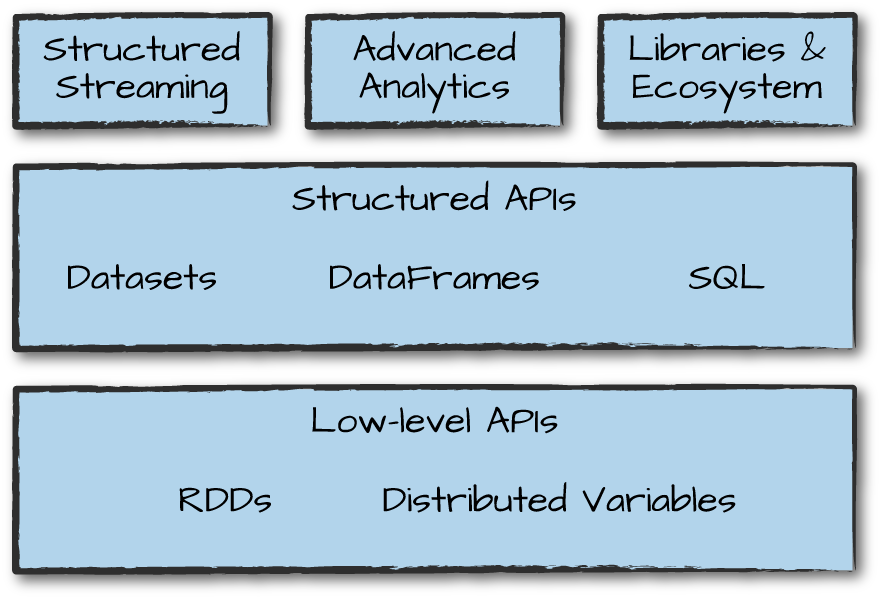

# 3. Spark 工具集一览


第二章中我们介绍了Spark的核心概念，如Spark结构化API中的转换和动作。这些加单的概念性模块是Apache Spark庞大的工具和库生态系统的基础。Spark由这些基础的组合-低级别API和结构化API-然后是一系列附加功能的标准库。



Spark的库支持许多不同的任务，从图分析，机器学习到流，以及与大量计算和存储系统的集成。本章介绍Spark提供的大部分内容，包括我们尚未提及的一些API以及一些主要的库。每一节中，可以在其他本书的其他部分看到更多的细节；本章的目标是提供尽可能的概述。


本章包括以下部分：

* 使用spark-submit运行生产程序
* Dataset：结构化数据的类型安全API
* 结构化流
* 机器学习和高级分析
* RDD：Spark的低级API
* SparkR
* 第三方包生态系统

在浏览完毕后，可以跳刀本书的相应章节，找到相关特定主题的答案。


## 运行生产程序

Spark使得开发和创建大数据程序变得简单。Spark通过spark-submit（内置命令行工具）将交互式探索转换为生产应用程序变得容易。spark-submit做了一件事情：它让我们发送应用代码到一个集群然后在上面启动和执行它。提交后，应用程序将一直运行知道退出（完成任务）或碰到错误。可以用所有Spark支持的集群管理器如Standalone，Mesos和YARN执行此操作。


spark-submit提供了多种控制，有了这些控制就可以指定应用需要的资源，应用如何执行以及命令行参数。


我们还可以用任何Spark支持的开发语言写应用程序然后提交并执行。最简单的例子是在本地机器上运行应用程序。我们会通过运行一个简单的Spark附带的Scala程序展示这一点，在Spark目录中运行以下命令：

```
./bin/spark-submit \
  --class org.apache.spark.examples.SparkPi \
  --master local \
  ./examples/jars/spark-examples_2.11-2.2.0.jar 10
```

这个示例程序就是计算Pi到某个小数位。这里我们告诉spark-submit我要在本地机器运行，指定了我们要运行的类和JAR，以及该类的一些命令行参数。


我们也可以使用下边的命令运行这个程序的Python版本：

```Python
./bin/spark-submit \
  --master local \
  ./examples/src/main/python/pi.py 10
```

通过修改spark-submit的master参数，我们可以将相同的程序提交到给运行Spark的独立集群管理器，Mesos或YARN。


spark-submit在运行本书中打包的许多实例时将派上用场。在本章接下来的内容中，我们看看一些在Spark介绍中尚未看到的API的例子。


## Dataset：类型安全的结构化API

我们将介绍的第一个API是Spark结构化API的一个类型安全版本缴Dataset，用于在Java和Scala中写静态类型的代码。Dataset API在Python和R中是不可用的，因为这些语言是动态类型的。


回想一下，我们在前一章中看到的DataFrame是Row类型的对象分布式集合，可以容纳各种类型的表格数据。Dataset API使用户能够将Java/Scala类分配给DatgaFrame中的类并将其作为类型化对象的集合进行操作，类似于Java ArrayList或Scala Seq。Dataset上可用的API是类型安全的，也就是说你不能偶然地将数据集中的对象视为与最初放入的类不同的类的对象。这使得Dataset对于写大应用程序特别有吸引力，有了它多个软件工程师必须通过定义好的接口进行交互。


Dataset类使用包含的对象类型进行参数化：Java中的Dataset<T>和Scala中的Dataset[T]。比如，Dataset[Person]会保证只能包含Person类的对象。从Spark2.0开始，支持的类型是遵循Java中的JavaBean模式和Scala中的case类。这些类型是收到限制的，因为Spark需要能够自动分析类型T并为Dataset中的表格数据创建适当的模式。


关于Dataset的一个好处，只有在需要或想要时才能使用它们。比如，在下边的例子中，我们会定义我们的数据类型并通过任意map和过滤功能操作它。在执行了我们的操作之后，Spark可以自动将其重新转换为DataFrame，并且我们可以通过使用Spark包含的数百个函数来进一步操作它。这使得降级到低级别，在需要时执行类型安全的的代码，和升级到SQL进行更快速的分析变得简单。下边的小例子展示了如何使用类型安全的函数和类DataFrame的SQL表达式快速写业务逻辑：

```Scala
// in Scala
case class Flight(DEST_COUNTRY_NAME: String,
                  ORIGIN_COUNTRY_NAME: String,
                  count: BigInt)
val flightsDF = spark.read
  .parquet("/data/flight-data/parquet/2010-summary.parquet/")
val flights = flightsDF.as[Flight]
```

最后一个优点是，当在Dataset上调用collect或take时，它将在Dataset中收集正确类型才能够的对象，而不是DataFrame Rows。这样可以轻松获得类型安全且可以在分布式和本地中不需要修改代码安全地执行操作：

```Scala
// in Scala
flights
  .filter(flight_row => flight_row.ORIGIN_COUNTRY_NAME != "Canada")
  .map(flight_row => flight_row)
  .take(5)

flights
  .take(5)
  .filter(flight_row => flight_row.ORIGIN_COUNTRY_NAME != "Canada")
  .map(fr => Flight(fr.DEST_COUNTRY_NAME, fr.ORIGIN_COUNTRY_NAME, fr.count + 5))
```

我们在第11章中深入的介绍Dataset。


## 结构化Streaming

结构化Streaming是在Spark2.2中变成生产级别的流式处理高级API。使用结构化流式处理，可以用流式的方式执行一些在批处理中用到的Spark 结构化API操作。这可以减少延迟并运行增量处理。关于结构化流的最好的事是它让我们不用修改代码就能高速快速地从流流中提取值。它还是概念化变得容易，以为我们可以将批处理作业作为一个方式原型化它，然后就可以将其转换为流作业。所有这些工作的方式是增量地处理数据。


我们通过一个简单的例子来看看使用结构化Streaming是多么简单。我们使用retail-data 数据集，它有特殊的日期和时间供我们可用。我使用按天划分的文件集，每个文件代表一天的数据。


我们使用这种格式模拟被不同进程按照一致和规则的方式产生的数据。这是零售数据，因此想象这些是零售店正在生产的，并被发送到一个可以被我妈的流作业读取的位置。


分享数据的一个样本以便于你能够参考是值得的：

```
InvoiceNo,StockCode,Description,Quantity,InvoiceDate,UnitPrice,CustomerID,Country
536365,85123A,WHITE HANGING HEART T-LIGHT HOLDER,6,2010-12-01 08:26:00,2.55,17...
536365,71053,WHITE METAL LANTERN,6,2010-12-01 08:26:00,3.39,17850.0,United Kin...
536365,84406B,CREAM CUPID HEARTS COAT HANGER,8,2010-12-01 08:26:00,2.75,17850...
```


因此，我们首先将数据视为静态数据集进行分析然后创建一个DataFrame。我们也从这个静态数据集中创建一个模式（流中有多种我们会接触到的模式推断方式）:

```Scala
// in Scala
val staticDataFrame = spark.read.format("csv")
  .option("header", "true")
  .option("inferSchema", "true")
  .load("/data/retail-data/by-day/*.csv")

staticDataFrame.createOrReplaceTempView("retail_data")
val staticSchema = staticDataFrame.schema
```

```Python
# in Python
staticDataFrame = spark.read.format("csv")\
  .option("header", "true")\
  .option("inferSchema", "true")\
  .load("/data/retail-data/by-day/*.csv")

staticDataFrame.createOrReplaceTempView("retail_data")
staticSchema = staticDataFrame.schema
```

因为我们在使用时序数据，值得一提的是我们如何分组和聚合我们的数据。在本例中，我们将查看特定客户（由CustomerId识别）进行大量购买的销售时间。比如，我们增加一个总花费列，看一下一个客户在哪天消费了最多。


window函数在聚合中将包含每天的所有数据。它只是我们数据中时间序列列上的一个窗口。这对于操作日期和时间错是非常有用的工具，因为我们可以以更人性化的形式（通过间隔）指定我们的需求，Spark为我们将这些组合在一起：

```Scala
// in Scala
import org.apache.spark.sql.functions.{window, column, desc, col}
staticDataFrame
  .selectExpr(
    "CustomerId",
    "(UnitPrice * Quantity) as total_cost",
    "InvoiceDate")
  .groupBy(
    col("CustomerId"), window(col("InvoiceDate"), "1 day"))
  .sum("total_cost")
  .show(5)
```

```Python
# in Python
from pyspark.sql.functions import window, column, desc, col
staticDataFrame\
  .selectExpr(
    "CustomerId",
    "(UnitPrice * Quantity) as total_cost",
    "InvoiceDate")\
  .groupBy(
    col("CustomerId"), window(col("InvoiceDate"), "1 day"))\
  .sum("total_cost")\
  .show(5)
```

值得注意的是可以将其以SQL代码运行，正如我们在前一章中看到的。


下边是你看到的输出例子：

```
+----------+--------------------+------------------+
|CustomerId|              window|   sum(total_cost)|
+----------+--------------------+------------------+
|   17450.0|[2011-09-20 00:00...|          71601.44|
...
|      null|[2011-12-08 00:00...|31975.590000000007|
+----------+--------------------+------------------+
```

null值表示我们没有CustomerId。


这是静态DataFrame版本；如果你熟悉这些语法就不会有什么惊讶的了。


因为你可能是在本地模式中运行的，设置shuffle分区数量为一个合适的值是一个好的实践。这个配置指定shuffle后创建的分区的数量。默认，这个值是200，但是可能机器上没有那么多executor，减到5是值得的。我们在第二章中做了相同的操作，所以如果不记得为什么它很重要，可以随时回顾一下。

```Scala
spark.conf.set("spark.sql.shuffle.partitions", "5")
```

现在我们看到它如何起作用，我们看一下流式的代码！你会注意到非常少的代码变化。最大的变化是我们使用readStream而不是read，此外还会注意到maxFilesPerTrigger参数，用来指定一次读取的文件数量。这使得我们的演示更“streaming”，在生产场景中，这个能会被省略。

```Scala
val streamingDataFrame = spark.readStream
    .schema(staticSchema)
    .option("maxFilesPerTrigger", 1)
    .format("csv")
    .option("header", "true")
    .load("/data/retail-data/by-day/*.csv")
```

```Python
# in Python
streamingDataFrame = spark.readStream\
    .schema(staticSchema)\
    .option("maxFilesPerTrigger", 1)\
    .format("csv")\
    .option("header", "true")\
    .load("/data/retail-data/by-day/*.csv")
```

现在我们可以看看我们的DataFrame是不是流：

```Scala
streamingDataFrame.isStreaming // returns true
```

我们建立行业之前的DataFrame操作相同的业务逻辑。我们执行一个求和：

```Scala
// in Scala
val purchaseByCustomerPerHour = streamingDataFrame
  .selectExpr(
    "CustomerId",
    "(UnitPrice * Quantity) as total_cost",
    "InvoiceDate")
  .groupBy(
    $"CustomerId", window($"InvoiceDate", "1 day"))
  .sum("total_cost")
```

```Python
# in Python
purchaseByCustomerPerHour = streamingDataFrame\
  .selectExpr(
    "CustomerId",
    "(UnitPrice * Quantity) as total_cost",
    "InvoiceDate")\
  .groupBy(
    col("CustomerId"), window(col("InvoiceDate"), "1 day"))\
  .sum("total_cost")
```

这是一个惰性操作，所以我们需要调用一个streaming动作来启动这个数据流的执行。


流式动作与我们传统的静态操作有点不同，因为我们将在某处填充数据，而不是只调用count之类的（无论如何在流上都没有任何意义）。我们将使用的动作将输出到一个内存表中，每次触发后将会更新。这种情况下，每个触发器是基于单个文集上的（我们设置的读参数）。Spark会修改内存表中的数据以便我们总能获取我们之前聚合中指定的最大值：

```Scala
// in Scala
purchaseByCustomerPerHour.writeStream
    .format("memory") // memory = store in-memory table
    .queryName("customer_purchases") // the name of the in-memory table
    .outputMode("complete") // complete = all the counts should be in the table
    .start()
```

```Python
# in Python
purchaseByCustomerPerHour.writeStream\
    .format("memory")\
    .queryName("customer_purchases")\
    .outputMode("complete")\
    .start()
```

我们启动流后，可以对它进行查询来调试结果是什么样的如果我们之前将结果输出到一个生产sink中：

```Scala
// in Scala
spark.sql("""
  SELECT *
  FROM customer_purchases
  ORDER BY `sum(total_cost)` DESC
  """)
  .show(5)
```

```Python
# in Python
spark.sql("""
  SELECT *
  FROM customer_purchases
  ORDER BY `sum(total_cost)` DESC
  """)\
  .show(5)
```

你会注意当读入更多数据时表格的组成会发生变化！对于每个文件，结果可能会也可能不会根据数据变化。自然，因为我们分组客户，我们希望看到顶部的客户购买量随着时间的推移而增加（并且会持续一段时间！）。另一个可用的将结果写出的选项是console:

```Scala
purchaseByCustomerPerHour.writeStream
    .format("console")
    .queryName("customer_purchases_2")
    .outputMode("complete")
    .start()
```

你不需要在生产中使用这些流方法中的任何一个，但他们对于演示结构化流的能力提供了便利。注意这个window是构建在时间时间上的，而不是Spark处理数据的时间。这是结构化流已经解决的Spark Streaming的缺点之一。我们将在第五部分更深入地介绍流。


## 机器学习和高级分析

Spark另一个流行的方面是它使用内置的机器学习库MLlib执行大规模机器学习的能力。MLlib支持预处理，整理和模型训练，对数据进行大规模预测。你时甚至可以在 Strucutred Streaming中使用MLlib中训练的模型。Spark提供了一个复杂的机器学习API用于执行各种机器学习任务，从分类到回归，聚合到深度学习。为了演示这个功能，我们会子啊我们的数据上使用*k-means*执行一些基础的聚合。

​	*k*-means是一个聚合算法，k中心在数据中是随机赋值的。然后将最接近该店的点分配给一个类，并计算分配点的中心。该中心点称为质心。然后，我们将靠近该质心的点标记到质心的类，并将质心移动到集群的新中心。我们有限次迭代重复这个过程或指导收敛（中心点停止变化）。


Spark开箱包含许多预处理方法。要演示这个鞋方法，我们从原始数据开始，在将数据转换为合适的格式前构建转换，此时我们可以实际训练我们的莫模型然后提供预测：

```Scala
staticDataFrame.printSchema()
```

```
root
 |-- InvoiceNo: string (nullable = true)
 |-- StockCode: string (nullable = true)
 |-- Description: string (nullable = true)
 |-- Quantity: integer (nullable = true)
 |-- InvoiceDate: timestamp (nullable = true)
 |-- UnitPrice: double (nullable = true)
 |-- CustomerID: double (nullable = true)
 |-- Country: string (nullable = true)
```


​	MLlib中的机器学习算法需要数据表示为数字。我们当前的数据多种不同的类型，包括时间戳，整数和字符串。因此我们需要将数据转换为数字格式。在这个例子中，我们将使用多个DataFrame转换操作我们的日期数据：

```Scala
// in Scala
import org.apache.spark.sql.functions.date_format
val preppedDataFrame = staticDataFrame
  .na.fill(0)
  .withColumn("day_of_week", date_format($"InvoiceDate", "EEEE"))
  .coalesce(5)
```

```Python
# in Python
from pyspark.sql.functions import date_format, col
preppedDataFrame = staticDataFrame\
  .na.fill(0)\
  .withColumn("day_of_week", date_format(col("InvoiceDate"), "EEEE"))\
  .coalesce(5)
```

我们还将需要将数据分给成训练和测试集。在这个例子中，我们将按照发生某次购买的日期手动执行此操作；但是，我们也可以使用MLlib的转换API通过拆分或交叉验证创建训练和测试数据集（这些主题在第6部分详细介绍）：

```Scala
// in Scala
val trainDataFrame = preppedDataFrame
  .where("InvoiceDate < '2011-07-01'")
val testDataFrame = preppedDataFrame
  .where("InvoiceDate >= '2011-07-01'")
```

```Python
# in Python
trainDataFrame = preppedDataFrame\
  .where("InvoiceDate < '2011-07-01'")
testDataFrame = preppedDataFrame\
  .where("InvoiceDate >= '2011-07-01'")
```

现在已经准备好数据了，我们将其拆分为训练和测试集。因为他是个时间序列数据，我们按照日期对数据进行拆分。虽然这可能不是我们训练和测试的最佳拆分，但对于本例的意图和目的是比较合适的。我们将看到这将我们的数据集大致分为两半：

```Scala
trainDataFrame.count()
testDataFrame.count()
```

注意到这些转换事务我们在第二章中介绍的DataFrame转换。Spark的MLlib还提供了一些能够执行常规转换的转换。其中一个转换是StringIndexer：

```Scala
// in Scala
import org.apache.spark.ml.feature.StringIndexer
val indexer = new StringIndexer()
  .setInputCol("day_of_week")
  .setOutputCol("day_of_week_index")
```

```Python
# in Python
from pyspark.ml.feature import StringIndexer
indexer = StringIndexer()\
  .setInputCol("day_of_week")\
  .setOutputCol("day_of_week_index")
```

这会将周中的每天转换成相应的数字。比如，Spark可能将周六表示为6，周一表示为1.然而，使用这种数字模式，我们在暗示周六比周一大（通过纯数字值）。这显然是不对的。为了解决这个问题，我们需要使用OneHotEncoder将这些值中的每一个编码Wie他们自己的列。这些布尔值指出星期几是否是一周中的相关日期：

```
// in Scala
import org.apache.spark.ml.feature.OneHotEncoder
val encoder = new OneHotEncoder()
  .setInputCol("day_of_week_index")
  .setOutputCol("day_of_week_encoded")
```

```Python
# in Python
from pyspark.ml.feature import OneHotEncoder
encoder = OneHotEncoder()\
  .setInputCol("day_of_week_index")\
  .setOutputCol("day_of_week_encoded")
```

这里的每一个都将产生产生一组我们将组装的向量中的列。Spark中的所有机器学习算法豆浆Vector类型作为输入，它必须是一组数值：

```Scala
// in Scala
import org.apache.spark.ml.feature.VectorAssembler

val vectorAssembler = new VectorAssembler()
  .setInputCols(Array("UnitPrice", "Quantity", "day_of_week_encoded"))
  .setOutputCol("features")
```

```Python
# in Python
from pyspark.ml.feature import VectorAssembler

vectorAssembler = VectorAssembler()\
  .setInputCols(["UnitPrice", "Quantity", "day_of_week_encoded"])\
  .setOutputCol("features")
```

这里我们有是三个关键特征：价格、数量和星期几。下一步，我们将其设置为一个管道，以便未来任何数据需要转换的时候经历完全相同的过程：

```Scala
// in Scala
import org.apache.spark.ml.Pipeline

val transformationPipeline = new Pipeline()
  .setStages(Array(indexer, encoder, vectorAssembler))
```

```Python
# in Python
from pyspark.ml import Pipeline

transformationPipeline = Pipeline()\
  .setStages([indexer, encoder, vectorAssembler])
```

训练准备分两步。首先我们需要将转换器适配到数据集。我们在第6章深入介绍，但基本上我们的StringIndexer需要知道要索引多少个唯一的值。这些有了之后，编码很容器但是Spark必须要按顺序查看要索引的列中的所有不同的值，以便稍后存储这些值：

```Scala
// in Scala
val fittedPipeline = transformationPipeline.fit(trainDataFrame)
```

```Python
# in Python
fittedPipeline = transformationPipeline.fit(trainDataFrame)
```

在我们拟合训练数据之后，我们准备采用拟合管道并以一致且可复用的方式转换我们所有的数据：

```Scala
// in Scala
val transformedTraining = fittedPipeline.transform(trainDataFrame)
```

```Python
# in Python
transformedTraining = fittedPipeline.transform(trainDataFrame)
```

这个时候，值得注意的是我们可以将模型训练纳入我们的管道内。我们不选择为了演示一个缓存数据用例。相反，我们将在模型上执行一些超参调整，因为我们不想一遍又一遍地重复完全相同的转换；特别的，我们会使用缓存，一个优化，我们在第四章中将讨论更多细节。这将在内存中放一份中间转换的数据的副本，让我们可以比重新运行整个管道更低的消耗重复访问它。如果你对这会产生多大的不同有兴趣，可以跳过下边的一行，不进行缓存地运行整个训练。然后在缓存后再试依次；你会看到结果是非常显著的：

```
transformedTraining.cache()
```

我们现在有一个训练集；是时候训练模型了。首先我们会用到的导入相关模型并实例化：

```Scala
// in Scala
import org.apache.spark.ml.clustering.KMeans
val kmeans = new KMeans()
  .setK(20)
  .setSeed(1L)
```

```
# in Python
from pyspark.ml.clustering import KMeans
kmeans = KMeans()\
  .setK(20)\
  .setSeed(1L)
```

Spark中，训练机器学习模型分两步。第一，我们初始化一个未训练模型，然后训练它。MLlib的DataFrame API中每个算法总是有两个类型。他们遵循着命名模式，对于未训练的版本是Alogrithm，训练后的版本是AlgorithmModel。我们的例子中，是KMeans和KMeansModel。


MLlib DataFrame API中的评估量和我们之前使用StringIndexer等预处理转换器看到的接口大致相同。这应该不足为奇的，因为它使整个管道（包括模型）的训练变得简单。对于我们这里的目的，我们希望一步一步地做一些实行，所以我们选择在这个例子中不这样做：

```Scala
// in Scala
val kmModel = kmeans.fit(transformedTraining)
```

```Python
# in Python
kmModel = kmeans.fit(transformedTraining)
```

我们训练好模型后，我可以根据我们训练集的一些成功优点计算损失。数据集上的损失是相当高的，这可能是因为我们没有很好地预处理和缩放我们的输入数据，这些在第25章中介绍：

```Scala
kmModel.computeCost(transformedTraining)
```

```Scala
// in Scala
val transformedTest = fittedPipeline.transform(testDataFrame)
```

```Python
# in Python
transformedTest = fittedPipeline.transform(testDataFrame)
```

```Scala
kmModel.computeCost(transformedTest)
```

自然地，我们可以继续优化这个模型，更多的预处理以及执行更多的假设参数超参调优以确保我们获得一个好的模型。我们在第六部分介绍它。


## 低级API

Spark包含了许许多多低级基本元语，允许通过RDD进行任意Java和Python对象操作。事实上，Spark中的所有内容都建立在RDD之上。正如我们将在第四章中讨论的，DataFrame操作建立在唉RDD上，编译回这些低级别的工具，以便高效的执行分布式操作。有些事情你需要使用RDD，特不是你正在读取或操作原数据时，但在大多数情况下，你应该坚持使用结构化API。RDD是比DataFrame更低级别的，因为它们向终端用户显示物理执行特性（如分区）。


你可能会用到RDD的一个事是并行化在驱动机器上存储的原数据。比如，我们并行化一些基本数字然后创建一个DataFrame。我们可以将那些数字转换为一个DataFrame，和其他DataFrame一起用：

```Scala
// in Scala
spark.sparkContext.parallelize(Seq(1, 2, 3)).toDF()
```

```Python
# in Python
from pyspark.sql import Row

spark.sparkContext.parallelize([Row(1), Row(2), Row(3)]).toDF()
```

RDD在Scala和Python中都可用。然而他们并不是相同的。因为一些底层实现细节,这和DataFrame API不同(执行特性是相同的)。我们在第四部分介绍底层API，包括RDD。作为终端用户，除非维护旧的Spark代码，否则不需要特爱多地用RDD来执行任务。现代Spark中没有实例，除了操作一些非常原始的未处理和非结构化数据外，您需要使用RDD而不是结构化API。


## SparkR

SparkR是Spark上运行R的工具。它遵循所有Spark的其他语言绑定的相同的原则。要是用SparkR，你可以简单地导入到环境中然后运行代码。它与Python API都相似，除了它遵循R语法而不是Python语法。在大多数情况下，几乎所有可用的Python都可以在SparkR中找到：

```R
# in R
library(SparkR)
sparkDF <- read.df("/data/flight-data/csv/2015-summary.csv",
         source = "csv", header="true", inferSchema = "true")
take(sparkDF, 5)
```

```R
# in R
collect(orderBy(sparkDF, "count"), 20)
```

R用户还可使用其他R库，例如magrittr中的管道运算符，从而使得Spark转换更像R。这使得与其他库如ggplot一起使用-以实现更复杂的绘图，变得更容易。

```R
# in R
library(magrittr)
sparkDF %>%
  orderBy(desc(sparkDF$count)) %>%
  groupBy("ORIGIN_COUNTRY_NAME") %>%
  count() %>%
  limit(10) %>%
  collect()
```

我们不会像Python一样包含R代码例子，因为几乎每个使用于Python的概念都适用于SparkR。唯一的不同是语法。我们在第七部分介绍SparkR和sparklyr。


## Spark的生态系统和包

关于Spark的一个最好的部分是包生态系统和社区中创建的工具。这些工具中的一部分甚至迁移到核心Spark项目中，以为它们已经成熟且被广泛使用。在撰写本文时，包列表相当长，编号超过300，并且还在经常增加。你可以在[spark-packages.org](https://spark-packages.org/)找到Spark包的最大索引，任何用户可以发布到此包仓库。你可以在网上找到其他项目和包；比如在GitHub上。


## 总结

我们希望本章向你展示了将Spark应用于您自己的业务的方式和技术挑战。Spark的简单，强大的编程莫醒醒使其已于应用于大量问题，并且由数百不同的人围绕它创建的大量包，是Spark能够有效地处理许多业务问题和挑战的证明。随着生态系统和社区的成长，越来越多的包可能会继续出现。我们期待社区中会有什么！


本书的其余部分提供这个产品的更深层介绍。